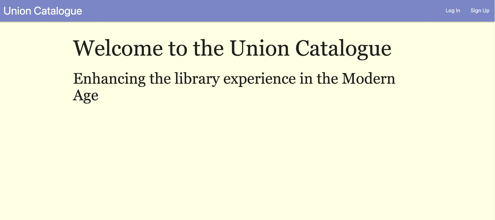
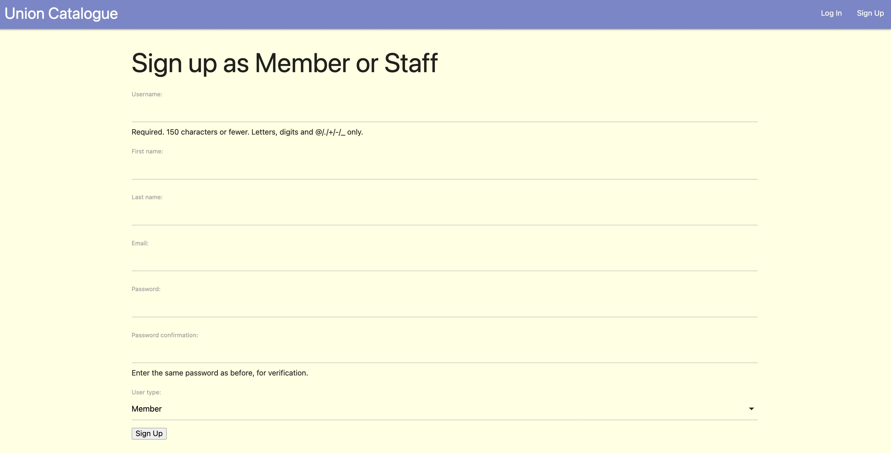
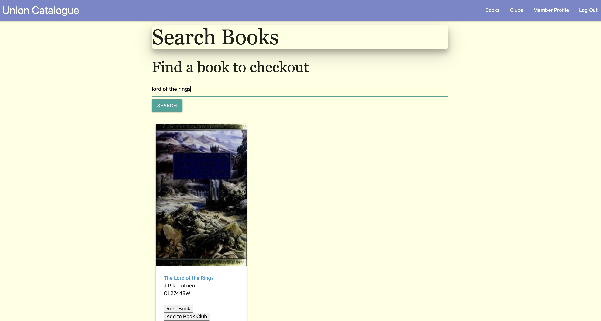
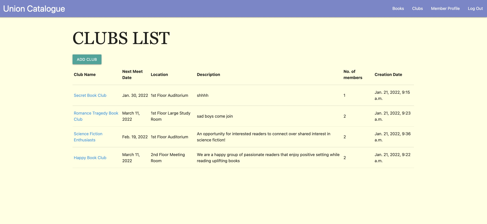
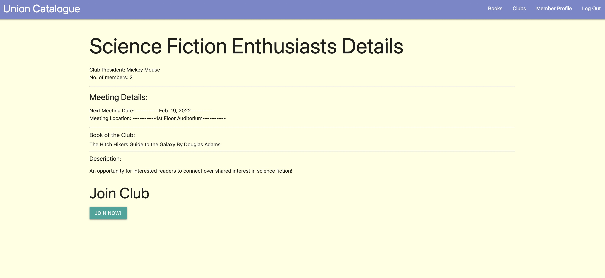
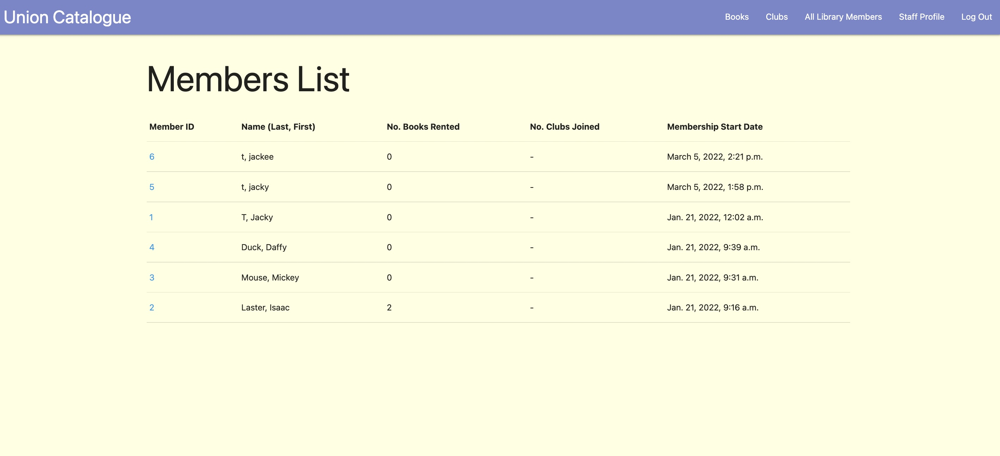

# Union Catalogue - The Library Management System

## General Information
Union Catalogue is a management app for libraries that want to integrate to a fast Python based system to organize its data. 

   
 

## Technologies used
* Python
* Django
* PostgreSQL
* Bootstrap
* Git v2.33.1 Mac
* Visual Studio Code v1.62.3

## Features
### Usage
* Join the [Union Catalogue](https://unioncatalogue.herokuapp.com/) system here!
* [Project Planning](https://trello.com/b/MVagzm9g/union-catalogue) with WireFrames and ERD.

### Implemented
* Django built-in authentication
* Custom function and Class-based views for linking relationships between data models
* Open Library Search API
* User-centric full CRUD - GET, POST, PUT, and DELETE methods for both member and staff

### Future Development Ideas
* Improve async API data speed by further filtering in search and reduce limit size of output
* Include further functionality for staff work schedule sign-up for weeks to months in advance
* Integrate into mobile view for more millenial ease-of-use and audience outreach

